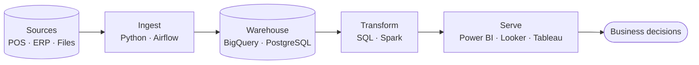

 

  
  
  

## 👋 About me

I'm a **Senior Data Analyst** based in Pekanbaru, Indonesia, with 10+ years of experience across retail, education, and telecom. I lead analysis work at **Babada Corp**, act as the bridge between business stakeholders and data, and keep data quality in check.

I'm now extending that analyst foundation into **data engineering** — building pipelines that are scheduled, tested, and reproducible instead of manual.

- 🏢 I'm currently working at **Babada Corp**
- 🌱 I'm currently learning **Data Engineering** — Airflow, Spark, Docker, and BigQuery
- 📊 Strongest at sales, promotion, and customer-behaviour analysis
- 💬 Ask me about anything
- 📫 How to reach me: [sr.arykurniawan@gmail.com](mailto:sr.arykurniawan@gmail.com)

## 🛠️ Tech stack

| Area | Tools |
| :--- | :--- |
| **Languages** |   |
| **Data processing** |    |
| **Orchestration & infra** |   |
| **Warehouse & cloud** |    |
| **BI & visualisation** |      |
| **Workspace** |   |

## 🔄 How I work with data

## 🚀 Featured projects

<!-- Replace each row with a real repository. Keep 3–4 of your best. -->

| Project | What it does | Stack |
| :--- | :--- | :--- |
| Project | What it does | Stack |
| :--- | :--- | :--- |
| 🛢️ [**volve-well-ml**](https://github.com/srarykurniawan/volve-well-ml) | Machine learning on well data from the Volve oil field dataset. | `Machine Learning` `HTML` |
| 👥 [**HR Analytics End-to-End**](https://github.com/srarykurniawan/Project-BI-HR-Analytics-End-to-End) | HR analytics dashboard for a fictional 500-employee company (8 departments, 6 cities) built on 3 years of data, Jan 2023 – Dec 2025. | `Python` `BI Dashboard` |
| 📈 [**Sales Demand Forecasting**](https://github.com/srarykurniawan/sales_demand_forecasting_datascienceproject) | Production-style retail demand forecasting: EDA, leakage-free feature engineering, model comparison, SHAP interpretability, and a served REST API. | `Python` `Jupyter` `SHAP` `REST API` |
| 🛒 [**E-Commerce Data Pipeline**](https://github.com/srarykurniawan/End-to-End-Data-Engineering-Project-E-Commerce-Pipeline) | End-to-end data engineering project: an orchestrated ETL pipeline for e-commerce data. | `Python` `Airflow` `Docker Compose` |
| 📚 [**ebook-data-collection**](https://github.com/srarykurniawan/ebook-data-collection) | E-book data collection project. | `Data Collection` |

## 💼 Work experience

### 🏢 Babada Corp

**Senior Data Analyst** · *January 2023 – Present*

- Leading data analysis to support business and operational decision-making.
- Acting as a liaison between the data team and cross-functional stakeholders.
- Ensuring the quality and consistency of data in reports and analyses.
- Providing guidance and reviewing the work of Data Analysts.

**Data Analyst Staff** · *November 2018 – December 2022*

- Performing daily, weekly, and monthly sales analysis based on products and categories.
- Evaluating promotional performance (discounts, bundling, marketplace promotions).
- Analyzing customer purchasing patterns.

### 🎓 Politeknik Caltex Riau (PCR)

**Marketing Analyst Staff** · *March 2015 – October 2018*

- Analyzing new student admission data based on study programs, admission channels, and time periods.
- Evaluating the effectiveness of promotional channels based on the conversion funnel.
- Developing marketing performance dashboards and reports for management purposes.

### 📡 Huawei Technologies

**Supply Chain Analyst Staff** · *November 2013 – December 2014*

- Analyzing the distribution of materials from the central warehouse to regional and project sites.
- Compiling dashboards and warehouse performance reports on a regular basis.
- Monitoring stock levels, inventory turnover, and aging materials.

## 🎓 Education

| | Institution | Program | Location | Years |
| :-: | :--- | :--- | :--- | :--- |
| 🎓 | [**Politeknik Caltex Riau**](https://pcr.ac.id/) | Bachelor of Electronic Engineering | Pekanbaru | 2009 – 2013 |
| 🏫 | [**SMA Muhammadiyah 1**](https://www.smamsapku.sch.id/) | Science | Pekanbaru | 2006 – 2009 |

---

**Open to collaboration on data pipelines and analytics projects.**
📫 [sr.arykurniawan@gmail.com](mailto:sr.arykurniawan@gmail.com)

